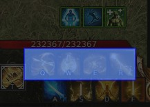
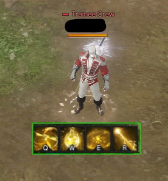

# Area Selector Accessibility App

## 🌐 Description

This application is designed to assist users with limited field of view or visual accessibility needs.
It enables precise selection of any region on the screen and magnifies it through an adjustable, accessibility-friendly zoom window (“Lupa”).

The tool allows users to reposition and resize the magnified area, control zoom intensity, and toggle passthrough mode (allowing clicks to pass through the magnifier).
All settings are saved automatically, providing a flexible and customizable interface tailored to visually impaired users.
Its modular multi-binary architecture ensures smooth operation, whether selecting areas, magnifying content, or adjusting configurations.


---

## 🦀 Requirements to Run the Project

- **Backend / Core Application:** Rust (2021 Edition)  
- **Frontend / UI:** egui + eframe

---

### 📥 Cloning the Repository

```bash
git clone https://github.com/jfan-dev/area-selector-accessibility-app.git
```

---

### ▶️ Running the Main App

```bash
# Access the project folder
cd area_selector/

# Build in debug mode
cargo build

# Run the main window (panel with buttons)
cargo run --bin area_selector
```

---

### ▶️ Running the Area Selector

```bash
# Fullscreen tool to select the screen area
cargo run --bin seletor
```

---

### ▶️ Running the Magnifier (Lupa)

```bash
# Start the magnifier window with area/zoom/position
cargo run --bin lupa -- <x> <y> <width> <height> [zoom|passthrough] [pos_x pos_y]
```

---

### ▶️ Running From Release Build (No Rust Required)

If you prefer not to compile the project, you can run it directly using the pre-built binaries:

1. Download the **`target/release`** folder (or extract it from a release ZIP).
2. Inside this folder, run the main executable:

   **`area_selector.exe`**  
   Launches the main control panel for selecting areas and starting the magnifier.


### 📌 Auxiliary Binaries

These executables are also available in the same folder:

- **`seletor.exe`**  
  Opens the fullscreen area selector for choosing the capture region.

- **`lupa.exe`**  
  Starts the magnifier window (requires arguments such as position, size, zoom, or passthrough).


### ⚠️ Important

Make sure all `.exe` files remain in the **same directory**,  
as they depend on shared resources and configuration files.

---

## 👑 Demonstration


---

### ✍🏻️ Additional Features

| Feature | Preview | Description |
|--------|---------|-------------|
| Area Selection Tool |  | Fullscreen drag-to-select with live preview |
| Magnifier Window |  | Zoomed region with adjustable zoom factor |
| Passthrough Mode |  | Lets clicks pass through the magnifier window |

---

## ✍🏻️ Technology Stack

| Technology | Purpose | Website |
|-----------|----------|---------|
| Rust | Core application and binaries | https://www.rust-lang.org/ |
| eframe / egui | Graphical UI framework | https://github.com/emilk/egui |
| Windows API | Screen capture & window mode control | https://learn.microsoft.com/windows |
| serde / serde_json | Persistent storage for config | https://serde.rs/ |

---

## 🛠 Challenges and Solutions

### 🟥 Problem — Persisting User Configuration  
Keeping area, zoom and position across sessions required a clean persistent solution integrated into user directories.  
**Solution:** implemented `AppConfig` using `serde_json` and stored it under the OS config path.

### 🟩 Problem — Click-Through Mode  
Switching between interactive and passthrough modes required dynamic editing of extended window styles.  
**Solution:** read and reapplied HWND using `WS_EX_TRANSPARENT` plus layered attributes.

### 🟦 Problem — High CPU Usage & Memory Leak During Selection

Originally, the selection overlay (the blue rectangle drawn during area selection) was rendered every frame at ~60 FPS while also capturing screen data using the scrap crate.
This caused unnecessary GPU/CPU usage and a visible memory leak, especially on 4K monitors, because the capture pipeline and rendering loop were being executed far more often than necessary.

**Solution:** replaced the frame-based capture from scrap with the Windows Accessibility API, which provides a more efficient, event-driven way to retrieve screen content. This eliminated the leak, reduced resource usage, and made the selection preview significantly smoother and more stable overall.

---

## 🐛 Known Bugs / Limitations

### - Magnifier window does not automatically update its size or position.
  After adjusting zoom or coordinates in the main app, the magnifier must be restarted manually or the stated toogled between passthrough because the window is not yet reactive to changes in configuration. The window size (inner_size) and position (viewport.position) are only applied when the binary (lupa.exe) launches.

---

## 🐼 Developed by

**Jaime Fernandes**  
📧 jfernan10@gmail.com  
🔗 https://www.linkedin.com/in/jfan-dev
